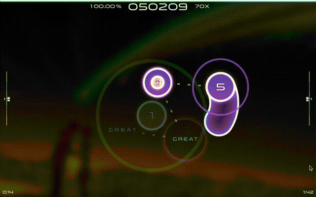

# WebOsu 2.0

Osu! is a rhythm game in which you click circles on the screen, following the rhythm of the music.

Powered by [PixiJS](https://www.pixijs.com) and [Sayobot](https://osu.sayobot.cn). This project is a fork & continuation of [the original WebOsu.](https://github.com/111116/webosu)

**(This project is not complete is under continuous development)**

This is an unofficial implementation of [Osu!](https://osu.ppy.sh). Scoring and judgement rules can differ from that of official Osu!. Modes other than Osu!std are unsupported.

## Footage

game in action:

## Todo list

- [ x ] Update from outdated PixiJS v6 to v7
- [ ] Update from outdated PixiJS v7 to v8
- [ ] uploadable skins
- [ ] ability to switch between beatmap providers

## License Notes

Some media files are copyrighted by [ppy](https://github.com/ppy/) and others. Check their respective license before you use them.
